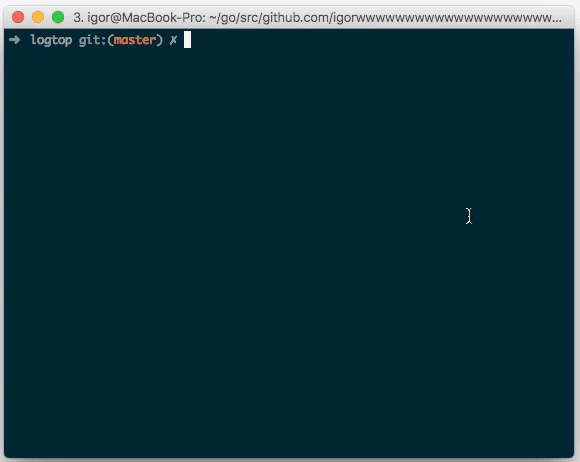

# logtop

a re-implementation of julien palard's [logtop](https://github.com/JulienPalard/logtop) in go.

i wanted it to run on osx also.

logtop is a program that reads events (lines) from stdin and outputs a live view of the frequency distribution. it essentially performs a `select event, count(*) from events group by event order by count(*) desc`, in a streaming manner.

this is useful for tailing log files and getting a sense of the frequency of events, grouped by a certain field (e.g. path, status code, source ip).

internally, it stores counts in an avl tree, in order (get it) to be able to retrieve them in a sorted manner.

this takes O(n) space where n is the cardinality of the input stream, as all lines are stored in the tree and also in a hash map). even with high cardinality streams, this is often acceptable.

we also retain timing about when an event was last seen, which allows old events to be pruned periodically.

fetching the top k elements takes O(log n) time, thanks to the avl tree.

logtop also tracks the rates of events, over a short window of time.

it's basically mongodb.

## uuh, that's a lot of text, please just explain what it does ok?

real-time counts of stuff. it shows you the highest counts. you decide which stuff you feed into it. but it's probably going to be fields extracted from a log file.

fine let me just show you what it looks like:



## example usage

tail a heroku log stream and look at frequent (method, path) pairs.

```
heroku logs --tail -a <app> | awk '{ if ($2 == "heroku[router]:") { print $4, $5 } }' | go run cmd/logtop/main.go
```

## todo

* batching, or make single threaded and remove locks completely
* time partitioning
